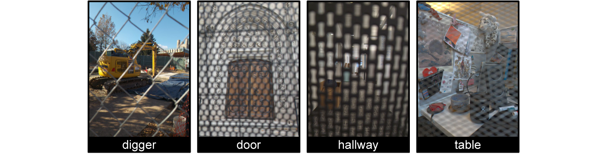
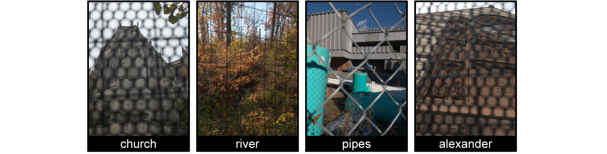
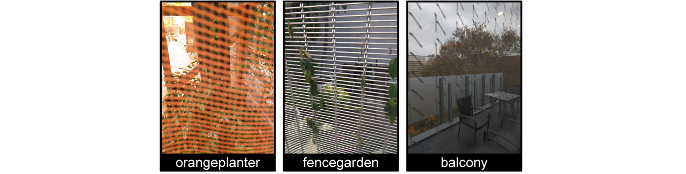
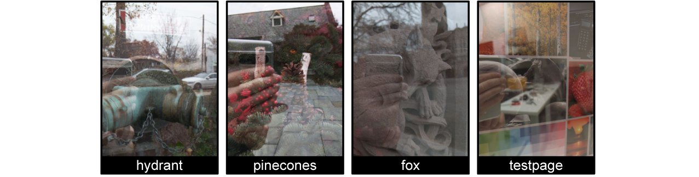
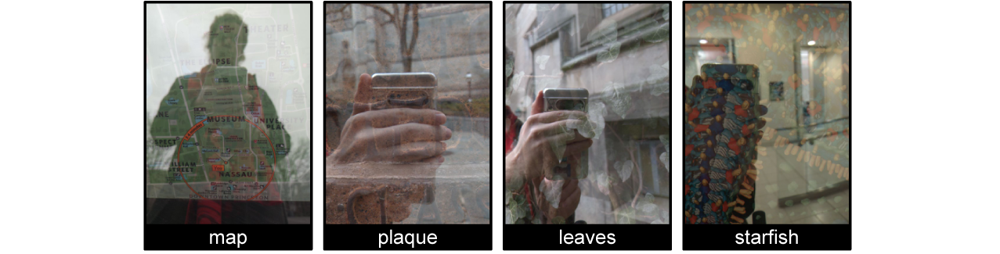
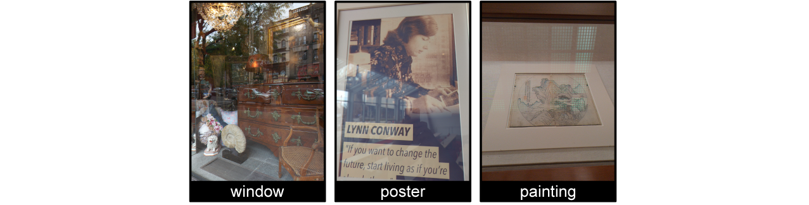
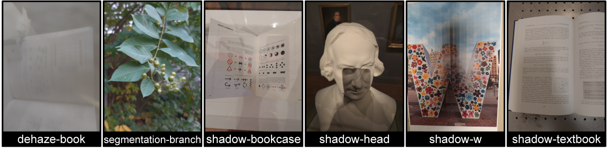

# Neural Spline Fields for Burst Image Fusion and Layer Separation
<a href="https://colab.research.google.com/github/princeton-computational-imaging/NSF/blob/main/tutorial.ipynb" style="text-decoration: none;">
  
</a>
<a href="https://github.com/Ilya-Muromets/Pani" style="text-decoration: none;">
  
</a>

This is the official code repository for the CVPR 2024 work: [Neural Spline Fields for Burst Image Fusion and Layer Separation](https://light.princeton.edu/publication/nsf/). If you use parts of this work, or otherwise take inspiration from it, please considering citing our paper:
```
@inproceedings{chugunov2024neural,
  title={Neural spline fields for burst image fusion and layer separation},
  author={Chugunov, Ilya and Shustin, David and Yan, Ruyu and Lei, Chenyang and Heide, Felix},
  booktitle={Proceedings of the IEEE/CVF Conference on Computer Vision and Pattern Recognition},
  pages={25763--25773},
  year={2024}
}
```

## Requirements:
- Code was written in PyTorch 2.0 on an Ubuntu 22.04 machine.
- Condensed package requirements are in `\requirements.txt`. Note that this contains the exact package versions at the time of publishing. Code will most likely work with newer versions of the libraries, but you will need to watch out for changes in class/function calls.
- The non-standard packages you may need are `pytorch_lightning`, `commentjson`, `rawpy`, and `tinycudann`. See [NVlabs/tiny-cuda-nn](https://github.com/NVlabs/tiny-cuda-nn) for installation instructions. Depending on your system you might just be able to do `pip install git+https://github.com/NVlabs/tiny-cuda-nn/#subdirectory=bindings/torch`, or might have to cmake and build it from source.

## Project Structure:
```cpp
NSF
  ├── checkpoints  
  │   └── // folder for network checkpoints
  ├── config
  │   └── // network and encoding configurations for different sizes of MLPs
  ├── data  
  │   └── // folder for long-burst data
  ├── lightning_logs  
  │   └── // folder for tensorboard logs
  ├── outputs  
  │   └── // folder for model outputs (e.g., final reconstructions) 
  ├── scripts  
  │   └── // training scripts for different tasks (e.g., occlusion/reflection/shadow separation)
  ├── utils  
  │   └── utils.py  // network helper functions (e.g., RAW demosaicing, spline interpolation)
  ├── LICENSE  // legal stuff
  ├── README.md  // <- you are here
  ├── requirements.txt  // frozen package requirements
  ├── train.py  // dataloader, network, visualization, and trainer code
  └── tutorial.ipynb // interactive tutorial for training the model
  ```
## Getting Started:
We highly recommend you start by going through `tutorial.ipynb`, either on your own machine or [with this Google Colab link](https://colab.research.google.com/github/princeton-computational-imaging/NSF/blob/main/tutorial.ipynb). 

TLDR: models can be trained with:

`bash scripts/{application}.sh --bundle_path {path_to_data} --name {checkpoint_name}`

And reconstruction outputs will get saved to `outputs/{checkpoint_name}-final`

For a full list of training arguments, we recommend looking through the argument parser section at the bottom of `\train.py`.

## Data:
You can download the long-burst data used in the paper (and extra bonus scenes) via the following links:

 1. Main occlusion scenes: [occlusion-main.zip](https://soap.cs.princeton.edu/nsf/data/occlusion-main.zip) (use `scripts/occlusion.sh` to train)
 

  2. Supplementary occlusion scenes: [occlusion-supp.zip](https://soap.cs.princeton.edu/nsf/data/occlusion-supp.zip) (use `scripts/occlusion.sh` to train)
 

   3. In-the-wild occlusion scenes: [occlusion-wild.zip](https://soap.cs.princeton.edu/nsf/data/occlusion-wild.zip) (use `scripts/occlusion-wild.sh` to train)
 

  4. Main reflection scenes: [reflection-main.zip](https://soap.cs.princeton.edu/nsf/data/reflection-main.zip) (use `scripts/reflection.sh` to train)
 

  5. Supplementary reflection scenes: [reflection-supp.zip](https://soap.cs.princeton.edu/nsf/data/reflection-supp.zip) (use `scripts/reflection.sh` to train)
 

   6. In-the-wild reflection scenes: [reflection-wild.zip](https://soap.cs.princeton.edu/nsf/data/reflection-wild.zip) (use `scripts/reflection-wild.sh` to train)
 

   7. Extra scenes: [extras.zip](https://soap.cs.princeton.edu/nsf/data/extras.zip) (use `scripts/dehaze.sh`, `segmentation.sh`, or `shadow.sh`)
 

   7. Synthetic validation: [synthetic-validation.zip](https://soap.cs.princeton.edu/nsf/data/synthetic-validation.zip) (use `scripts/reflection.sh` or `occlusion.sh` with flag `--rgb`)

We recommend you download and extract these into the `data/` folder.

## App:
Want to record your own long-burst data? Check out our Android RAW capture app [Pani!](https://github.com/Ilya-Muromets/Pani)

Good luck have fun,
Ilya
